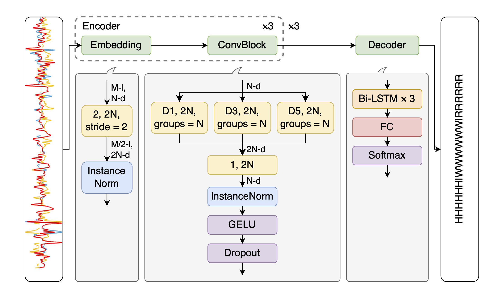

# Robust and Efficient Writer-Independent IMU-Based Handwriting Recognition

This repository is the official implementation of "Robust and Efficient Writer-Independent IMU-Based Handwriting Recognition".

## Introduction

The paper introduces a handwriting recognition model for IMU-based data, leveraging a CNN-BiLSTM architecture. The model is designed to enhance recognition accuracy for unseen writers.



### OnHW Word500 Right-Handed Dataset

- Righthanded writer-dependent/writer-independent OnHW-word500 dataset (WD: writer-dependent; WI: writer-independent)

| model                | WD CER    | WD WER    | WI CER    | WI WER    | #Params   | MACs    |
| -------------------- | --------- | --------- | --------- | --------- | --------- | ------- |
| CLDNN                | 16.18     | 50.98     | 15.62     | 36.71     | 0.75M     | 291M    |
| CNN+BiLSTM *(orig.)* | 17.16     | 51.95     | 27.80     | 60.91     | **0.40M** | 152M    |
| CNN+BiLSTM           | **15.47** | 51.55     | 17.66     | 43.45     | **0.40M** | 152M    |
| Ours-S               | 15.73     | **50.64** | **10.55** | **24.94** | 0.53M     | **79M** |

| model              | WD CER    | WD WER    | WI CER   | WI WER    | #Params   | MACs     |
| ------------------ | --------- | --------- | -------- | --------- | --------- | -------- |
| ResNet *(enc.)*    | **12.72** | **40.76** | 8.22     | 18.35     | 3.97M     | 591M     |
| MLP-Mixer *(enc.)* | 14.74     | 46.89     | 9.74     | 21.87     | 3.90M     | 802M     |
| ViT *(enc.)*       | 17.86     | 52.00     | 10.49    | 22.71     | **3.71M** | **477M** |
| ConvNeXt *(enc.)*  | 14.66     | 45.42     | 8.23     | 18.46     | 3.86M     | 600M     |
| SwinV2 *(enc.)*    | 13.23     | 43.72     | 8.62     | 19.60     | 3.88M     | 601M     |
| Ours               | 14.43     | 43.90     | **7.37** | **15.12** | 3.89M     | 600M     |

## Installation

Create a new conda virtual environment

```bash
conda create -n rewi python
conda activate rewi
```

Clone this repo and install required packages

```bash
git clone https://github.com/jindongli24/REWI.git
pip install -r requirements.txt
```

## Dataset

For commercial reasons, our datasets will not be published. Alternatively, you can use the OnHW public dataset for training and evaluation. In the paper, we use the right-handed writer-independent subset of the OnHW-words500 dataset. To download the dataset, please visit: https://www.iis.fraunhofer.de/de/ff/lv/dataanalytics/anwproj/schreibtrainer/onhw-dataset.html

We use a MSCOCO-like structure for the training and evaluation of our dataset. After the OnHW dataset is downloaded, please convert the original dataset to the desired structure with the notebook `onhw.ipynb`. Please adjust the variables `dir_raw`, `dir_out`, and `writer_indep` accordingly.

## Training

In the paper, models are trained in a 5-fold cross validation style, which can be done using the `main.py` to train each fold individually. Please adjust the configurations in the `train.yaml` configuation file accordingly. Additionally, as competitor CLDNN is trained with different strategy, please always use the `*_cldnn.*` files for training and evaluation.

```bash
python main.py -c configs/train.yaml
python main_mohamad.py -c configs/train_mohamad.yaml # CLDNN only
```

Alternatively, you can also train all folds at once sequentially with `train_cv.py`. The script will generate configuration files for all folds in a `temp*` directory and run `main.py` with these configuration files sequentially. After the training is finished, the `temp*` directory will be deleted automatically.

```bash
python train_cv.py -c configs/train.yaml -m main.py
```

## Evaluation

As we are using cross validation, the results are already given in the output files of training. However, you can always re-evaluate the model with the configuration and weight you want. In the case, please ajust the `test.yaml` file accordingly and run `main.py` with it.

```bash
python main.py -c configs/test.yaml
```

After you get all results of all folds, you can summarize the results and also calculate the #Params and MACs with `evaluate.py`.

```bash
python evaluate.py -c configs/train.yaml
# or
python evaluate.py -c path_to_config_in_work_dir
```

## License

This project is released under the MIT license. Please see the `LICENSE` file for more information.
