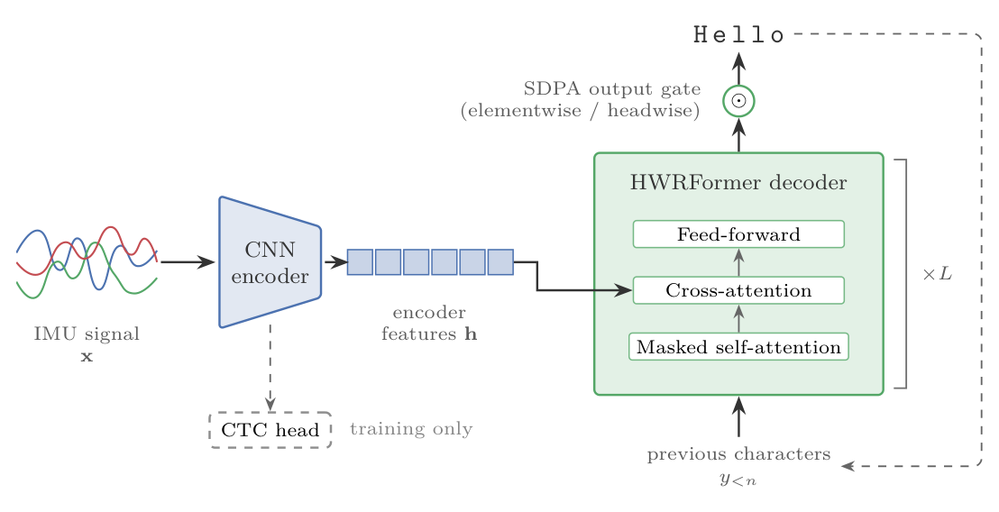

# Alignment-Stable Attention for Writer-Independent IMU Handwriting Recognition

Code for the Master's thesis *"Alignment-Stable Attention for Writer-Independent
IMU Handwriting Recognition"* (Muhammad Ajlal, Pattern Recognition Lab,
Friedrich-Alexander-Universität Erlangen-Nürnberg, 2026) and the companion paper
*"Mitigating Exposure Bias in IMU Handwriting Recognition with Noise Injection and
Hybrid CTC–AR Training"* (AALTD @ ECML PKDD 2026; standalone release:
[HWRFormer](https://github.com/muhammadajlal/HWRFormer)).

## Introduction

Online handwriting recognition from an inertial sensor pen: a 13-channel IMU
time series is mapped to text. The thesis starts from the recurrent CNN-BiLSTM-CTC
recognizer **REWI** (Li et al., iWOAR 2025) and studies two decoder families under
a shared 1D CNN encoder, on the public **OnHW-words500** benchmark
(writer-independent and writer-dependent splits) and on two private STABILO
word/sentence datasets:

- **HWRFormer** — a from-scratch autoregressive (AR) Transformer decoder with
  SDPA output gating, trained with cross-entropy and evaluated with greedy
  free-running decoding. Two training-time interventions target the resulting
  exposure bias: **noise injection** (random substitution in the teacher-forced
  decoder prefix) and **hybrid CTC–AR training** (a training-only CTC head on
  the encoder). An inference-time decoding study adds beam search, character
  n-gram / neural LMs, and N-best rescoring.
- **HWR-GPT** — the pretrained-decoder counterpart: the same encoder feeds a
  connector (MLP, Pool-MLP, lightweight Q-Former, gated multi-view) into a
  LoRA-adapted GPT-2, optionally with the same auxiliary CTC head, plus
  contrastive and CTC-conditioned alignment objectives.



*HWRFormer and hybrid training: the shared 1D CNN encoder feeds the AR
Transformer decoder, which consumes its own previous predictions at inference
(dashed loop); during hybrid training an auxiliary CTC head on the encoder adds
an alignment loss. The REWI reference (same encoder, BiLSTM + CTC decoder) is
shown in `figures/architecture.png`.*

## Results

All numbers are 5-fold cross-validation means in % (CER / WER, lower is better)
as reported in the thesis. Private STABILO results are included for reference;
the private data itself is not released (see Dataset).

**Migration from REWI to HWRFormer and gate selection** (Chapter 5). Parameters
and MACs at the OnHW word operating point; bold = best per column.

| Model | OnHW WI | OnHW WD | Priv. words | Priv. sent. | Params | MACs |
|---|---|---|---|---|---|---|
| REWI (CNN-BiLSTM-CTC) | 7.30 / 15.16 | **14.81** / 44.77 | **9.39** / 31.82 | **6.55** / 23.52 | 4.64 M | **413 M** |
| HWRFormer, ungated | 7.10 / **10.41** | 16.47 / 32.18 | 10.59 / 21.51 | 10.37 / 16.78 | 4.57 M | 653 M |
| HWRFormer, elementwise gate | **6.94** / 10.51 | 16.31 / 31.92 | 9.96 / **19.10** | 9.28 / 15.00 | 4.64 M | 669 M |
| HWRFormer, headwise gate | 6.99 / 10.53 | 15.70 / **31.50** | 9.63 / **19.10** | 9.12 / **14.98** | 4.57 M | 667 M |

**Exposure-bias interventions on HWRFormer** (elementwise gate; noise injection
uses uniform substitution at p = 0.15, hybrid uses λ_ctc = 0.1).

| Model | OnHW WI | OnHW WD | Priv. words | Priv. sent. |
|---|---|---|---|---|
| REWI | 7.30 / 15.16 | 14.81 / 44.77 | 9.39 / 31.82 | **6.55** / 23.52 |
| HWRFormer | 6.94 / 10.51 | 16.31 / 31.92 | 9.96 / **19.10** | 9.28 / **15.00** |
| + noise injection | 6.86 / 13.18 | 13.52 / 36.05 | **7.79** / 23.69 | 7.09 / 18.87 |
| + hybrid CTC–AR | **6.83** / **10.17** | **13.39** / **27.80** | 9.37 / 19.76 | 9.38 / 17.08 |

Combining both interventions gives 6.70 / 11.49 / 7.85 / 9.73 % CER on the four
settings (thesis appendix). Noise injection removes 61–73 % of the
teacher-forcing gap on every setting, hybrid training 4–28 %; the paired
per-sample analysis, the writer-clustered intervals, and the decoding study are
in the thesis (Chapter 5).

**HWR-GPT: auxiliary CTC across connectors** (Chapter 6; λ_ctc = 0.2 on OnHW,
0.6 on private words; ≈ 5.1 M trainable parameters per row).

| Model | Connector | aux. CTC | OnHW WI | Priv. words |
|---|---|:-:|---|---|
| HWRFormer (reference) | — | — | 6.94 / 10.51 | 9.96 / 19.10 |
| HWR-GPT | MLP | | 7.45 / 11.45 | 27.93 / 43.93 |
| HWR-GPT | MLP | ✓ | 7.11 / 11.13 | 17.20 / 33.33 |
| HWR-GPT | Pool-MLP | | 7.71 / 11.74 | 24.87 / 40.24 |
| HWR-GPT | Pool-MLP | ✓ | 7.34 / 11.14 | 16.87 / 31.94 |
| HWR-GPT | Lightweight Q-Former | | 7.32 / 11.33 | 24.89 / 35.25 |
| HWR-GPT | Lightweight Q-Former | ✓ | **6.86** / **10.47** | **16.33** / **24.64** |
| HWR-GPT | Gated Multi-View | | 8.01 / 12.03 | 27.67 / 44.29 |
| HWR-GPT | Gated Multi-View | ✓ | 7.39 / 11.40 | 17.99 / 34.06 |

Auxiliary CTC lowers private-word CER on every fold for every connector
(32–38 % relative); pretrained GPT-2 initialization matters mainly on the private
data (random init: 57.21 % CER). Sequence-level contrastive alignment and
CTC-conditioned alignment heuristics move the embeddings closer but do not
reduce the remaining recognition gap to HWRFormer (thesis Sections 6.5–6.6).

## Installation

```bash
conda create -n rewi python=3.12.10
conda activate rewi
pip install -r environment-lock.txt      # exact thesis environment (PyTorch 2.9.1 + CUDA 12.8)
# or: pip install -r requirements.txt    # unpinned
export REPO=$(pwd)
```

Configs reference three placeholders that are expanded when a config is loaded:
`${REPO}` (this directory), `${DATA_ROOT}` (default `${REPO}/data`) and
`${RESULTS_ROOT}` (default `${REPO}/results`). Export `DATA_ROOT` / `RESULTS_ROOT`
to keep datasets and run outputs elsewhere. The retained package versions are
listed in [ENVIRONMENT.md](ENVIRONMENT.md).

HWR-GPT and the T5/ByT5 controls load Hugging Face weights from
`${REPO}/assets/hf_models/` offline; fetch them once with

```bash
python scripts/repro/download_hf_model.py gpt2 assets/hf_models/gpt2   # likewise t5-small, google/byt5-small
```

and verify against `model-assets.sha256`.

## Dataset

**OnHW-words500** (public): from the Fraunhofer IIS OnHW page
(<https://www.iis.fraunhofer.de/de/ff/lv/dataanalytics/anwproj/schreibtrainer/onhw-dataset.html>)
download the two **right-handed** OnHW-words500 archives, `OnHW-words500_indep.zip`
(writer-independent) and `OnHW-words500_dep.zip` (writer-dependent); the `_L`
archives are the left-handed variants and are not used. Extract each archive and
run `scripts/onhw.ipynb` once per split, setting the three variables in the first
code cell:

| Run | `dir_raw` | `dir_out` | `writer_indep` |
|---|---|---|---|
| WI | folder that contains the five fold directories of `OnHW-words500_indep` | `${DATA_ROOT}/onhw_wi_word_rh` | `True` |
| WD | folder that contains the five fold directories of `OnHW-words500_dep` | `${DATA_ROOT}/onhw_wd_word_rh` | `False` |

Each fold directory holds the released pickles (`all_x_dat_{train,val}_imu.pkl`,
`all_{train,val}_gt.pkl`, `{train,val}_ids.pkl`). The notebook drops empty
sequences and sequences longer than 1,024 timesteps, writes one 13-channel CSV per
sample and builds the per-fold `train.json` / `val.json`; the official fold
boundaries are preserved. (The exploratory equation configs use the
`OnHW-equations_{indep,dep}.zip` archives the same way.) The result is the
MSCOCO-like layout the loaders expect:

```
${DATA_ROOT}/onhw_wi_word_rh/
├── train.json          # per-fold annotations: label, filename, writer id
├── val.json
└── data/**/*.csv       # one 13-channel IMU trace per sample
${DATA_ROOT}/onhw_wd_word_rh/   # same layout
```

**STABILO** (private): `wi_word_hw6_meta` and `wi_sent_hw6_meta` are not
published for commercial reasons; the corresponding configs and result numbers
are kept for provenance only.

## Training

`configs/examples/` holds one ready-to-run config per model family
(OnHW WI; swap `onhw_wi_word_rh` → `onhw_wd_word_rh` in `dir_dataset` and
`dir_work` for WD):

| Config | Model |
|---|---|
| `configs/examples/rewi_ctc_onhw_wi.yaml` | REWI: CNN + BiLSTM + CTC |
| `configs/examples/hwrformer_onhw_wi.yaml` | HWRFormer (AR, elementwise SDPA gating) |
| `configs/examples/hwrformer_noise_injection_onhw_wi.yaml` | HWRFormer + noise injection |
| `configs/examples/hybrid_hwrformer_onhw_wi.yaml` | Hybrid CTC–AR HWRFormer |
| `configs/examples/hwr_gpt_hybrid_mlp_onhw_wi.yaml` | HWR-GPT (MLP connector, LoRA GPT-2, aux. CTC) |

Run all five folds sequentially, then aggregate:

```bash
python train_cv.py -c configs/examples/hwrformer_onhw_wi.yaml   # writes <dir_work>/fold_k/...
python evaluate.py -c configs/examples/hwrformer_onhw_wi.yaml   # 5-fold mean ± std, params, MACs
```

For a single fold set `idx_fold: 0..4` in the config and run
`python main.py -c <config>`. All thesis models train for 300 epochs (30 warm-up,
AdamW, cosine schedule, batch 64, seed 42) and keep the best validation-CER
checkpoint; each fold writes `checkpoints/best_cer.pth`, a `train_<ts>.json` with
per-epoch metrics and a `train_<ts>.log`.

Key knobs (see `configs/README.md` for the full index):

| YAML key | Purpose |
|---|---|
| `arch_en` / `arch_de` | encoder (`blconv_b`) / decoder (`bilstm_wide`, `ar_transformer_xs`, `ar_transformer_s`, `transformer_xs`, `vlm`, `t5-small`, `byt5-small`) |
| `use_gated_attention`, `gating_type` | SDPA output gating (`elementwise` \| `headwise`) |
| `input_corruption.{mode,p_replace}` | noise injection (`uniform`, `bigram_left`, `bigram_right`, `self_confusion`, `adjacent_swap`) |
| `dual_head.{enabled,lambda_ctc}` | hybrid CTC–AR training |
| `scheduled_sampling.*` | scheduled-sampling controls |
| `vlm_enabled`, `vlm.{connector_type,hybrid_ctc,hybrid_lambda_ctc,use_lora,…}` | HWR-GPT |
| `pretrained_decoder_checkpoint` | text-pretrained AR decoder from `pretrain_decoder.py` |

### Reproducing the thesis experiments

Every thesis table maps to a config directory and a result family; the mapping
is in [configs/README.md](configs/README.md), and
[REPRODUCIBILITY.md](REPRODUCIBILITY.md) records the exact result paths, the
selection rules, superseded runs and the statistical analysis scripts.
`bash scripts/repro/reproduce_tables.sh --data-root <DATA_ROOT> --out-root <dir>`
re-runs the OnHW WI/WD sanity subset end-to-end.

## Evaluation and analysis

| Script | Purpose |
|---|---|
| `evaluate.py` | 5-fold aggregation (best validation CER per fold) + params/MACs → `<dir_work>/results.json` |
| `eval_tf_gap.py` | teacher-forcing vs free-running CER gap on a saved fold (exposure-bias probe) |
| `eval_tf_perturbation.py`, `eval_single_corruption.py` | prefix-perturbation sweep and single-corruption recovery diagnostics |
| `decode_study.py` + `scripts/run_decode_*.sh` | inference-time decoding study: beam search, char n-gram KenLM, neural LM, N-best rescoring |
| `scripts/chapter6_analysis.py` | paired fold effects and intervals for the HWR-GPT tables |
| `analysis/scripts/` | figure and table generation for the thesis (these still hard-code the thesis result paths; adjust before use) |

## Repository layout

```
main.py                  # train / evaluate one fold (CTC, AR, hybrid, LM, HWR-GPT modes)
train_cv.py              # run all folds sequentially
evaluate.py              # 5-fold aggregation + params/MACs
eval_tf_gap.py           # exposure-bias probe (w/ vs w/o teacher forcing)
eval_tf_perturbation.py  # prefix-perturbation diagnostic
eval_single_corruption.py# single-corruption recovery diagnostic
decode_study.py          # decoding study harness
pretrain_decoder.py      # text-only AR decoder pretraining
rewi/                    # core library
  model/                 #   1D CNN encoders, AR Transformer decoder + SDPA gating, BiLSTM/Transformer CTC,
                         #   dual-head (hybrid), HWR-GPT (connectors, Q-Former, LoRA GPT-2), T5/ByT5
  dataset/               #   IMU loaders, augmentation, CTC/AR/LM collation
  training/              #   training loops, noise injection, scheduled sampling, auxiliary losses
  decoding/              #   AR/CTC beam search, KenLM and neural LM scoring
  analysis/              #   metrics, attention and encoder-feature diagnostics
configs/                 # examples/ (start here), thesis experiment families, legacy/ (see configs/README.md)
scripts/                 # data conversion (onhw.ipynb), repro helpers, decoding-study drivers, thesis analysis
analysis/scripts/        # figure/table generation
slurm/                   # FAU cluster launch scripts (provenance only)
docs/                    # Master's project report and thesis proposal
ENVIRONMENT.md, environment-lock.txt, model-assets.sha256   # retained environment
```

## License

MIT — see [LICENSE.txt](LICENSE.txt). The code builds on
[REWI](https://github.com/jindongli24/REWI) (Li et al.).

## Citation

```bibtex
@mastersthesis{ajlal2026thesis,
  title  = {Alignment-Stable Attention for Writer-Independent {IMU} Handwriting Recognition},
  author = {Ajlal, Muhammad},
  school = {Friedrich-Alexander-Universit{\"a}t Erlangen-N{\"u}rnberg},
  year   = {2026},
}

@inproceedings{ajlal2026hwrformer,
  title     = {Mitigating Exposure Bias in {IMU} Handwriting Recognition with
               Noise Injection and Hybrid {CTC}--{AR} Training},
  author    = {Ajlal, Muhammad and Li, Jindong and Zanca, Dario and
               Christlein, Vincent and Eskofier, Bj{\"o}rn},
  booktitle = {ECML PKDD Workshops: 11th Workshop on Advanced Analytics and
               Learning on Temporal Data (AALTD)},
  year      = {2026},
}
```

REWI baseline: Li, J., Hamann, T., Barth, J., Kämpf, P., Zanca, D., Eskofier, B.
*Robust and Efficient Writer-Independent IMU-Based Handwriting Recognition*,
iWOAR 2025, LNCS 16292. <https://doi.org/10.1007/978-3-032-13312-0_16>
